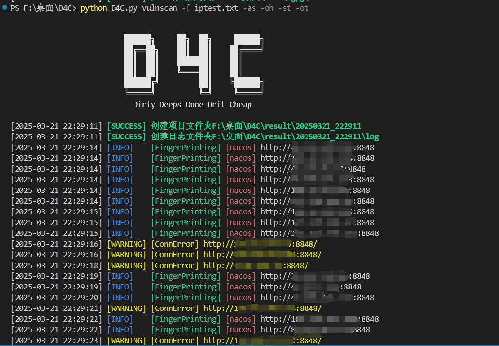
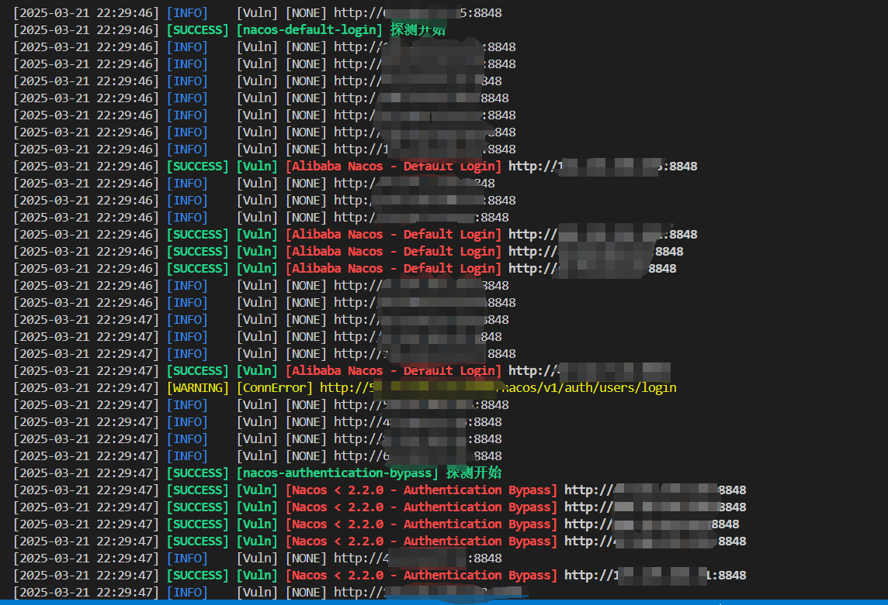
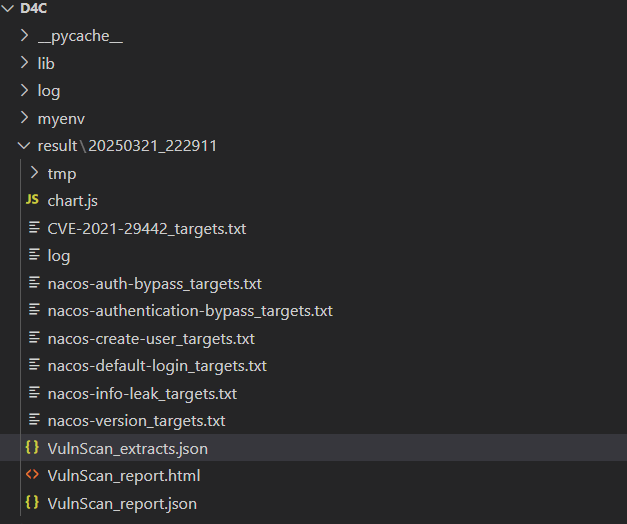
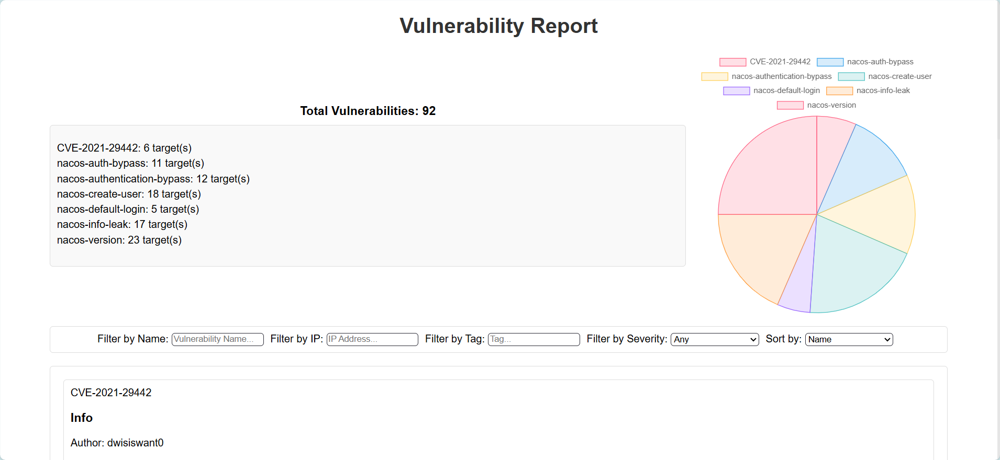
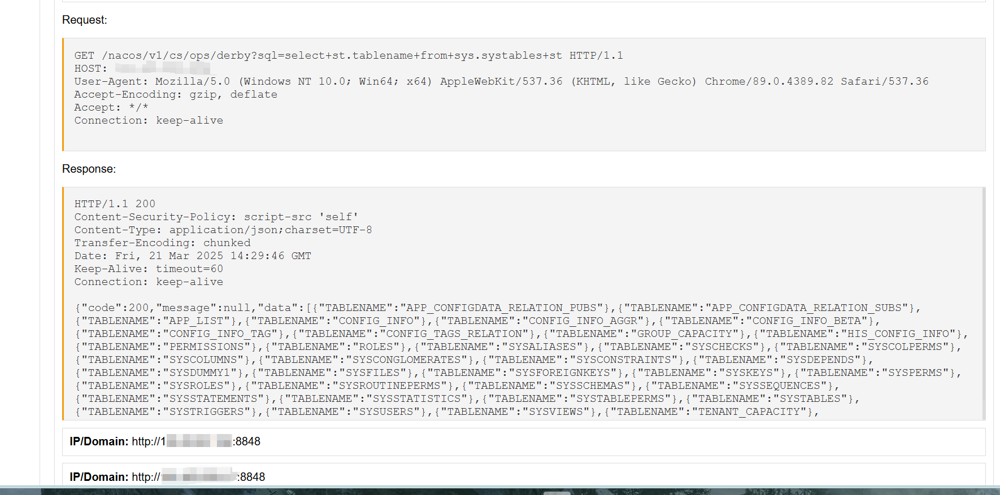

# D4C漏洞扫描工具
## 目前实现功能
### VulnScan模块
1. 多线程指纹识别自动运行漏扫模板
2. 支持Nuclei扫描模板
3. Nuclei-workflow模板扫描
4. 可以自定义扫描模板，内置多种提取器、扫描器等
5. 扫描项目管理，扫描html报告导出，每种漏洞主机导出
6. 模板搜索，更新
7. 项目打包发送邮箱
### SurvivalScan模块
1. 主机存活探测
2. 目录爆破
3. 特殊状态码指定
4. 多线程内存优化
5. 结果导出

**工具目前只支持web漏扫Socket数据流相关漏洞暂不支持，本项目目前仍在火速开发中，如遇问题师傅们多包含，有任何疑问可以直接加微信私聊king8n94**

## SetUp
**该项目依赖于fingerprinthub的指纹库和Nuclei模板库**使用前要先下载这两个项目

### 安装指纹库和Nuclei漏洞模板库

安装fingerprinthub的指纹库
```cmd
git clone https://github.com/0x727/FingerprintHub.git
```
在config.py文件中配置web指纹:`fingerprinting_dir = path\\to\\FingerprintHub\\web-fingerprint`
```cmd
git clone https://github.com/projectdiscovery/nuclei-templates.git
```
在config.py文件中配置web指纹:`templates_dir = "path\\to\\nuclei-templates"`
### 安装python依赖，并更新模板索引
安装相关依赖
```cmd
pip install -r requirements.txt
```
更新模板索引（在更新索引时会把新模板添加进索引，**如果模板路径变化请在templates文件夹中删除原有的索引文件**）
```cmd
python ./D4C.py --update
```
之后就能使用了
## 使用
简便帮助
```cmd
usage: D4C.py [-h] [-hh] [-c] [-cs CLEAR_SIZE] [--update] {vulnscan,survivalscan} ...

常用指令
    查看具体模块帮助: D4C.py <module> -h
    查看所有模块详细帮助: D4C.py -hh
    清理result: D4C.py -c -cs 1000


positional arguments:
  {vulnscan,survivalscan}
                        可用的模块
    vulnscan            漏洞扫描器模块
    survivalscan        探活模块

optional arguments:
  -h, --help            show this help message and exit
  -hh, --visable_Help   输出详细输出信息
  -c, --clear_result    清理result文件夹删除空文件
  -cs CLEAR_SIZE, --clear_size CLEAR_SIZE
                        清理result文件夹中小于clear_size 字节的文件默认值为1000,单位为KB
  --update              更新指纹以及nuclei-template
```
详细帮助
```cmd
----------------------------------------VulnScan Help-------------------------------------------

usage: D4C.py vulnscan [-h] [-u URL] [-f FILE] [-o OUTPUTFILE] [-t THREADINGS] [-p] [-l] [--nuclei NUCLEI] [--workflow WORKFLOW] [--taskfile TASKFILE] [-as] [-ot]  
                       [-oh] [-st] [--log_lever {debug,info,success,warning,error,critical}] [--send_email] [--search SEARCH]

常用命令
    列出可用模板: D4C.py vulnscan -l
    搜索可用模板：D4C.py vulnscan -s keyword
    指定nuclei模板测试指定url: D4C.py vulnscan -u <url> --nuclei <path2template> [-ot] [-p]
    指定nuclei模板扫描批量url: D4C.py vulnscan -f <urlfile> --nuclei <path2template_1>,<path2template_2> [-t 10] [-p] [-ot] [-oh] [--log_lever success][--send_email]


optional arguments:
  -h, --help            show this help message and exit
  -u URL, --url URL     VulnScan 目标URL
  -f FILE, --file FILE  VulnScan 包含目标URL的文件
  -o OUTPUTFILE, --outputfile OUTPUTFILE
                        VulnScan 指定输出文件，默认输出至.\result的项目文件夹中文件名为启动时间
  -t THREADINGS, --threadings THREADINGS
                        VulnScan 指定线程数默认5线程
  -p, --proxy           VulnScan 是否启用代理，如需使用代理在config.py文件下设置
  -l, --list            VulnScan 列出收录的poc以及对应编号
  --nuclei NUCLEI       VulnScan 使用指定Nuclei-Yaml模板扫描,指定多个模板用','分隔
  --workflow WORKFLOW   VulnScan 使用指定Nuclei-workflow模板扫描
  --taskfile TASKFILE   VulnScan 使用指定任务文件
  -as, --autoscan       VulnScan 自动指纹识别并自动模板漏扫
  -ot, --outputtarget   VulnScan 输出结果提取出目标
  -oh, --output_html_report
                        VulnScan 输出html报告
  -st, --save_tmpfile   VulnScan 保存临时文件
  --log_lever {debug,info,success,warning,error,critical}
                        设置日志等级默认为INFO
  --send_email          VulnScan 扫描完成后发送报告到邮箱要在config.py中配置发送邮箱和授权码以及接收邮箱组
  --search SEARCH       VulnScan 搜索模板


--------------------------------------SurvivalScan Help-------------------------------------------

usage: D4C.py survivalscan [-h] -f FILE [-o OUTPUTFILE] [-Sc SURVIVALSCAN_STATUSCODE [SURVIVALSCAN_STATUSCODE ...]] [-Su SURVIVALSCAN_BASEURL]
                           [-St SURVIVALSCAN_THREADS] [-Sb BUFFER_SIZE] [-p] [--log_lever {debug,info,success,warning,error,critical}]

常用命令
    查看帮助: D4C.py survivalscan -h
    常用探活: D4C.py survivalscan -f <hostfile>
    详细探活: D4C.py survivalscan -f <hostfile> [-o <outputfile>] [-Sc 200,300,403] [-Su "/index"] [-St 50] [-Sb 100]

optional arguments:
  -h, --help            show this help message and exit
  -f FILE, --file FILE  SurvivalScan 探活目标txt文件
  -o OUTPUTFILE, --outputfile OUTPUTFILE
                        SurvivalScan 输出的Excel(.xlsx) 不指定输出文件时结果将保存至项目文件夹.
                        esult中
  -Sc SURVIVALSCAN_STATUSCODE [SURVIVALSCAN_STATUSCODE ...], --SurvivalScan_statusCode SURVIVALSCAN_STATUSCODE [SURVIVALSCAN_STATUSCODE ...]
                        SurvivalScan 标识存活的状态码 默认200-500 参数例子: 200-299,403
  -Su SURVIVALSCAN_BASEURL, --SurvivalScan_baseurl SURVIVALSCAN_BASEURL
                        SurvivalScan 用于拼接的Base URL 例如：http://127.0.0.1:80{/index}
  -St SURVIVALSCAN_THREADS, --SurvivalScan_threads SURVIVALSCAN_THREADS
                        SurvivalScan 探活线程数默认为30,线程太大容易漏报建议20-30
  -Sb BUFFER_SIZE, --buffer_size BUFFER_SIZE
                        缓冲区大小用于优化内存
  -p, --proxy           开启代理,代理位于配置文件config.py中
  --log_lever {debug,info,success,warning,error,critical}
                        设置日志等级默认为INFO
```
### 扫描效果展示

命令

```cmd
python D4C.py vulnscan -f iptest.txt -as -oh -st -ot
```






项目导出



扫描说明：

- VulnScan_report.html————html报告（-oh参数才会生成报告）
- VulnScan_report.json————扫描结果json格式导出（便于二次分析）
- VulnScan_extracts.json————根据提取器提取的结果
- *_target.txt————对应漏洞存在的主机
- log————项目日志
- chart.js————html报告依赖的js，报告中统计功能的实现js依赖库，避免离线环境或者网络环境不好的情况，直接使用离线js
- tmp————临时文件多为指纹识别结果、提取中间文件、扫描结果的中间文件（扫描过程的请求和响应包）

### HTML报告





## TODO

- [ ] 指纹识别结果移除tmp，指纹识别结果展示
- [ ] 实现远程加载模板功能
- [ ] Socket模板扫描
- [ ] 端口扫描

**另外基于该项目的分布式漏洞管理系统正在火速开发敬请期待**
